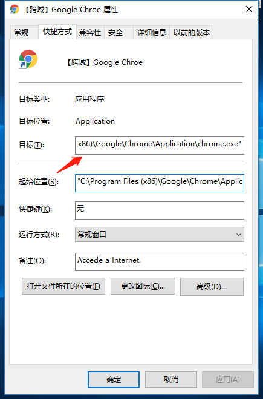
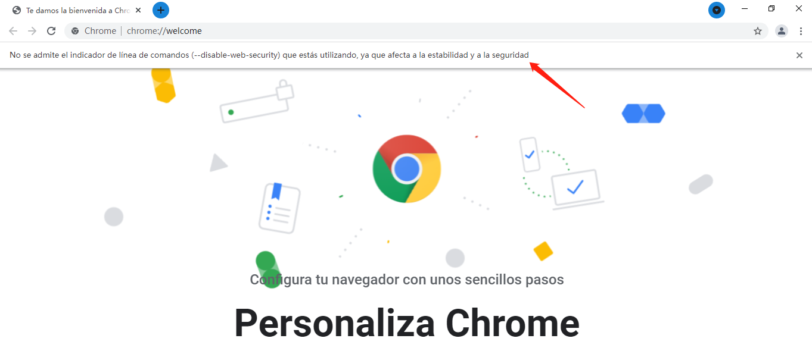

# 解决Chrome浏览器的跨域问题

对于前端来说，本地开发很经常会遇到跨域问题，最简单的方法就是将浏览器设置成可跨域，下面分别介绍 `Windows` 和 `Mac` 两端的配置方法。

## Windows

1. 克隆Chrome应用，重命名为 `【跨域】Google Chrome` 或任意一个容易识别的名字。

   

2. 右击打开属性，找到 `目标` 字段，并在目标字段后面加上参数：

```
 --disable-web-security --user-data-dir=D:\ChromeData\MyChromeDevUserData
```

其中 `D:\ChromeData\MyChromeDevUserData` 为跨域浏览器数据存储的地方，可以根据需要修改。



完整目标值为（仅供参考）：

```
"C:\Program Files (x86)\Google\Chrome\Application\chrome.exe" --disable-web-security --user-data-dir=D:\ChromeData\MyChromeDevUserData"
```

3. 打开 `【跨域】Google Chrome` ，如图则表示Chrome浏览器设置跨域成功。

   

   

## Mac

1. 打开终端

2. 输入命令后，会自动打开可跨域浏览器：

```sh
open -n /Applications/Google\ Chrome.app/ --args --disable-web-security --user-data-dir=/Users/XXX/MyChromeDevUserData
```

其中：`/Users/XXX/MyChromeDevUserData` 为跨域浏览器数据存储的地方，XXX为用户名，**根据实际修改**。
