# 解决跨域时Chrome浏览器cookie无法携带

## 背景

我原本开开心心地升级了Chrome浏览器，结果发现本地跑的项目登录一直报错，经过一番资料查询，发现是本地项目（localhost）请求接口时没有带上认证信息的cookie导致的登录失败。

这个问题我遇过好几次了，windows和mac都有，特地总结解决的方法。

## Chrome版本的cookie策略

| Chrome版本  | cookie策略                                                   |
| ----------- | ------------------------------------------------------------ |
| >= Chrome80 | 跨域无法携带；可设置配置项来开启允许跨域携带                 |
| >= Chrome91 | 跨域无法携带；删除了配置项开启方式，但可通过配置命令参数开启允许跨域携带 |
| >= Chrome94 | 跨域无法携带；没有开启办法                                   |

## >=Chrome80

**可设置配置项来开启允许跨域携带：**

1. Chrome浏览器打开 chrome://flags/ 页面

2. 搜索cookie，并设置`SameSite by default cookies`  、`Cookies without SameSite must be secure` 两项为 `disabled`

   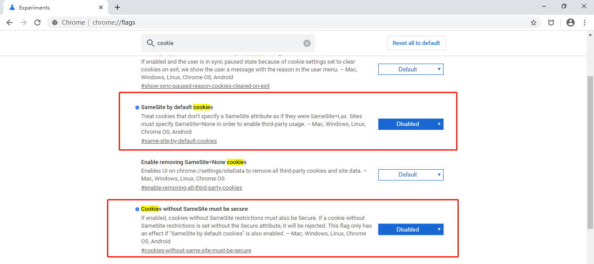

3. 重启浏览器

## >=Chrome91

**通过配置命令参数开启允许跨域携带:**

### Windows配置

1. 右击Chrome应用图标打开属性面板

2. 在 `目标` 那里增加命令参数：

   ```sh
   --disable-features=SameSiteByDefaultCookies,CookiesWithoutSameSiteMustBeSecure
   ```

   完整的目标值（我的）：

   ```sh
   "C:\Program Files (x86)\Google\Chrome\Application\chrome.exe" --disable-features=SameSiteByDefaultCookies,CookiesWithoutSameSiteMustBeSecure
   ```

   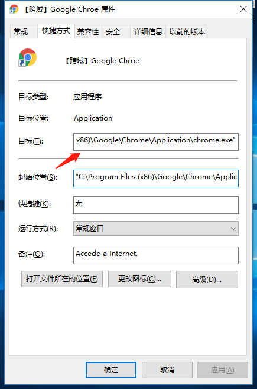

 3. 重启浏览器

### mac配置

1. 打开终端

2. 输入命令，自动打开浏览器：

```sh
open -n /Applications/Google\ Chrome.app/ --args --disable-features=SameSiteByDefaultCookies,CookiesWithoutSameSiteMustBeSecure
```

> 实际情况，我Mac的Chrome93版本没有生效，具体原因不详。

## >=Chrome94

不支持任何方式设置开启允许跨域携带，可通过设置代理设置为同域，或者通过安装低版本Chorme来解决。

### 设置代理

假设：

```
本地开发域名：localhost:3000
请求接口：http://mydemo.com/api/**
```

以vue2项目为例，设置代理:

```js
devServer: {
    // 开代理，解决开发时跨域问题
    proxy: {
      '/api': {
        target: 'http://mydemo.com',
        changeOrigin: true
      }
    }
}
```

最后项目中使用的都是 `localhost:3000`，就不会产生跨域问题：

```
本地开发域名：localhost:3000
请求接口：localhost:3000/api/**   # 请求localhost:3000/api/** 最终会代理到 http://mydemo.com/api/**
```

**但是，很多情况为了安全，接口只会将cookie设置到特定的域名下，那就需要在开发时增加子域**。

### 增加子域

上面例子中，如果某些cookie只能存在 `mydemo.com` 域名下，那么在 `localhost:3000` 是无法携带 `mydemo.com` 域名下的cookie的，这时我们需要设置子域名，将`localhost:3000` 指向 `localhost.mydemo.com:3000` 就行了。

#### 修改hosts文件(域名解析文件)

```
windows的hosts文件目录: C:\Windows\System32\drivers\etc\hosts
mac的hosts文件目录: /private/etc/hosts 【进入访达，Shift-Command-G 打开“前往文件夹”，输入/private/etc，找到hosts文件】
```

打开hosts文件并添加:

```
127.0.0.1   localhost.mydemo.com # 
```

> `127.0.0.1` 为本地ip，相当于 `localhost`, 此处作用是将 `localhost` 指向 `localhost.mydemo.com`。

最终项目中使用：

```
本地开发域名：localhost.mydemo.com:3000
请求接口：localhost.mydemo.com:3000/api/**
```

## 安装多版本Chrome

不管Chrome怎么升级，开发我只用Chrome79，就是快乐。

下面以Chrome79为例，介绍如何在已有Chrome下，再安装一个或多个其他版本的Chrome浏览器。

### Windows

`windows` 下各个版本Chrome的下载地址：https://www.chromedownloads.net/chrome64win-stable/

1. 选择chrome_win64_stable_79.0.3945.79版本下载（按需要下载对应版本）

   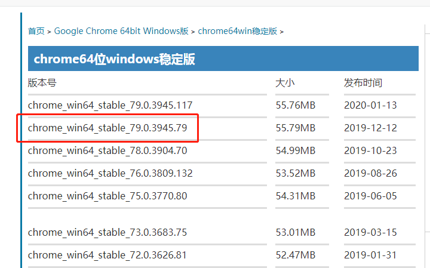

2. **不要直接安装**，先下载并安装7-Zip压缩软件

3. 右击.exe文件，选择`7-Zip -- 提取到当前位置`，会解压出`chrome.7z`的文件，再对`chrome.7z`文件进行解压，解压出 `chrome` 目录

   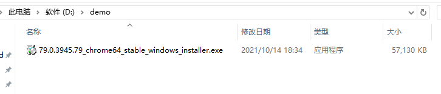

   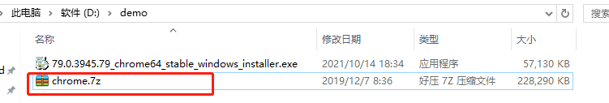

5. 进入目录 `chrome/Chrome-bin`，此时会看到chrome.exe文件，此时双击是不能直接打开79版本浏览器的；需要chrome.exe 右击，发送到桌面快捷方式

   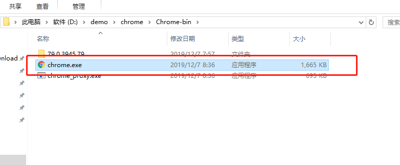

6. 回到电脑桌面，为方便区分，将  `chrome.exe `桌面快捷方式改名为 `chrome79.exe`，右击选择属性，在`目标` 值后添加参数：

      ```sh
       --disable-web-security --user-data-dir=D:\ChromeData\MyChromeDevUserData79
      ```

      `--user-data-dir`:  chrome79.exe 应用数据存储目录，**必须有**，根据个人情况修改。

      `--disable-web-security`: 设置跨域，可不加；

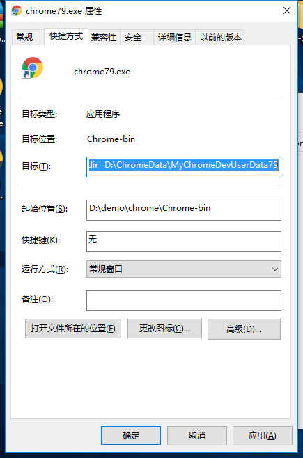

7. 双击 `chrome79.exe` 桌面快捷方式，就能打开了。
   

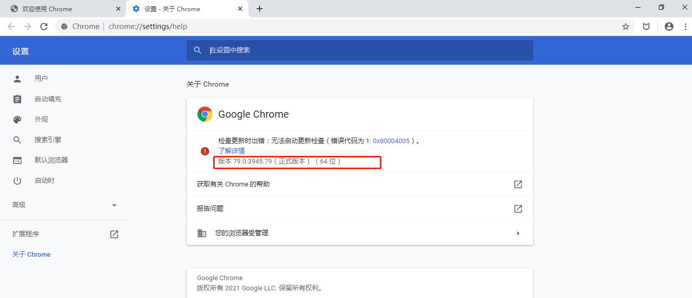

### Mac

`mac` 下各个版本Chrome的下载地址：https://google-chrome.cn.uptodown.com/mac/versions

1. 选择80.0.3987.53版本下载（按需要下载对应版本）

   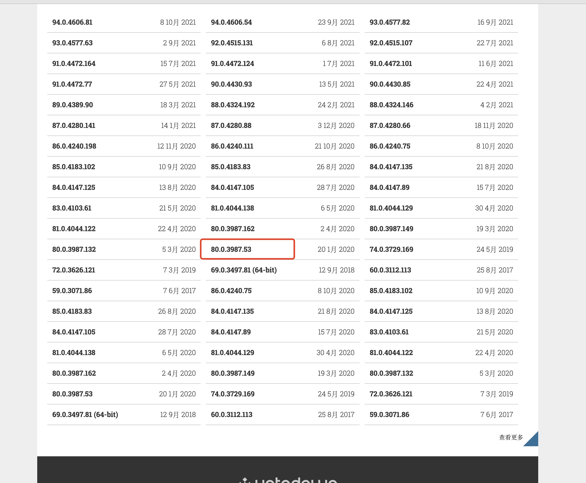

2. 双击dmg文件，将chrome拖到Application文件夹，选择保留两者，不要替换

   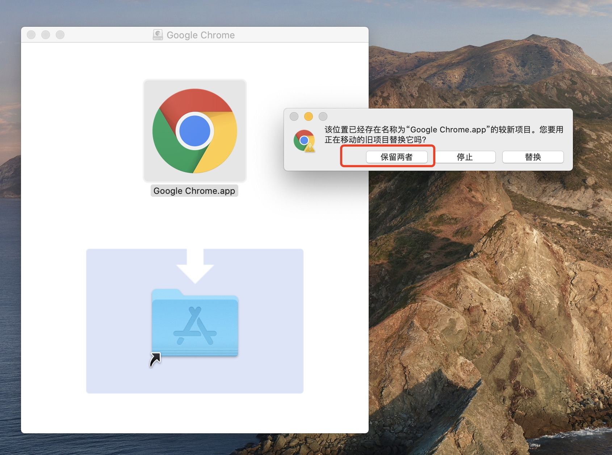

3. 打开应用程序目录，能看到有两个Google Chrome，而 `Google Chrome 2.app`  就是刚安装的程序，为确保安全，看一下程序的简介。

   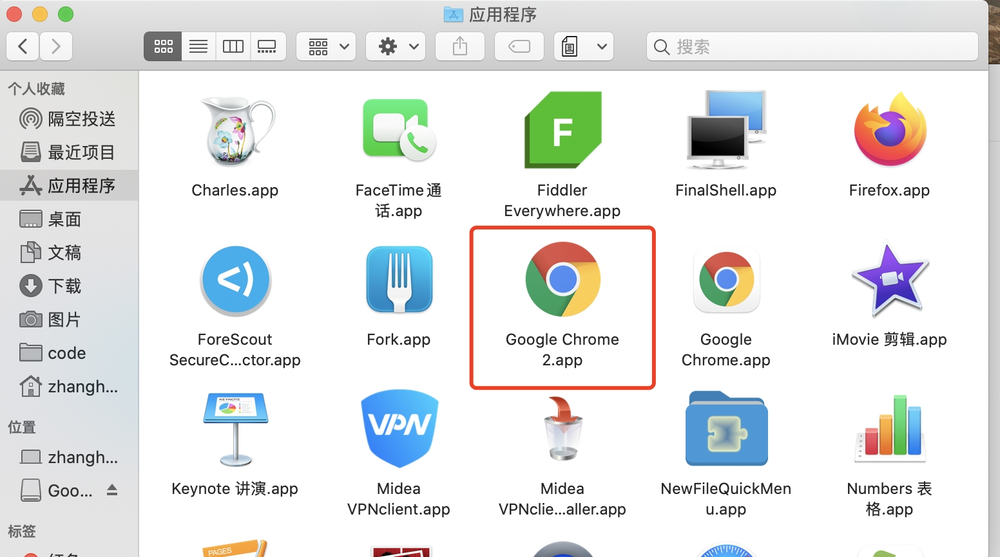

   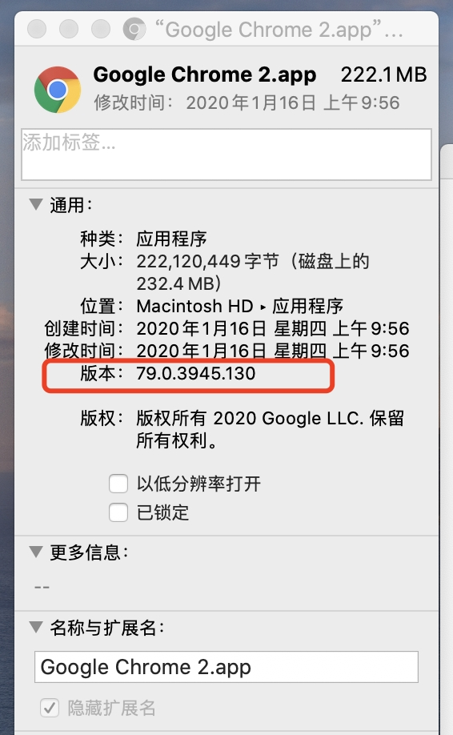

   虽然下载是80.0.3987.53版本，但是简介写的是79版本（真实的是79版本，有点挂羊头卖狗肉了）。

4. 为方便区分，将`Google Chrome 2.app`重命名为`Google Chrome79.app`。

5. 直接双击是无法打开79版本Chrome的，需要通过命令打开：

   ```sh
   open -n /Applications/Google\ Chrome79.app/ --args --disable-web-security --user-data-dir=/Users/XXX/MyChromeDevUserData79
   ```

   `/Applications/Google\ Chrome79.app/`: **程序目录，根据实际修改，此处 `\ `为转义字符**。

   `--disable-web-security`: 设置跨域，可不加；

   `--user-data-dir`：**79版本Chrome数据存储的目录，根据实际修改**。

   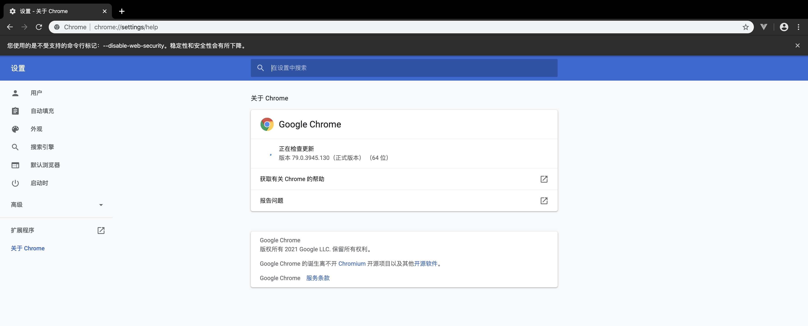

6. 为方便以后打开，将79版本Chrome应用保留在程序坞。
